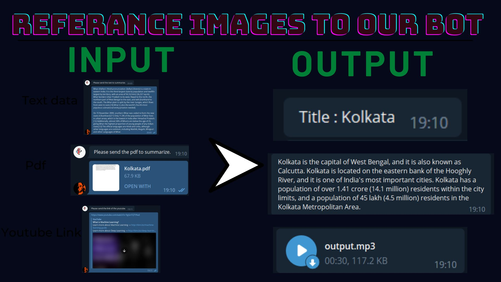

#  Saransh- Text Summarizer

</img><br>

In this project, we have made an automatic text summarizzer which summarizes different types of text data sources.

 We make the system to generate a summary of the text and provide a JSON output for the same. Alternatively, if there are web articles, PDFs, etc uploaded by the educator, the solution is able to summarize the large content into bite-sized information.


## API Reference

#### Get all items

```http
  https://openai.com/api/
```

| Parameter |Description                |
| :-------- |:------------------------- |
| `api_key` | **Required**. Your API key |
| `Bot_Token` | **Required** Telegram Bot Token |   

You need to import these libraries, if not downloaded use pip install
```bash
numpy
requests
convertapi
gtts
jsonpickle
nltk
openai
pdfplumber
pydaisi
PyPDF2
pyTelegramBotAPI
wget
youtube_transcript_api
```
 

#  Telegram bot

</img><br>


## 🛠 Skills
Python,GPT3,Telegram Bot,Machine Learning


